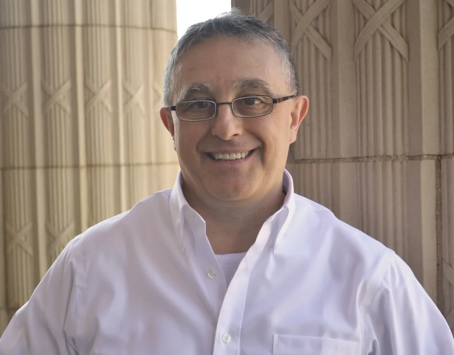

<section class="ra-hero" aria-labelledby="hero-title">
  

    
Computational genomics · Large language models · Reproducible research

    <h1 id="hero-title">Reproducible AI-Driven Approaches to Molecular and Evolutionary Genomics</h1>
    
I am an Associate Professor in the Department of Biology at Texas A&amp;M University and lead the Aramayo Lab, an interdisciplinary research and teaching program connecting molecular genetics, computational genomics, and protein model evaluation. Our current work investigates what protein language model scores contain, where their signals are valid, and how much remains unexplained by additive main-effects models.

    

      <a class="md-button md-button--primary" href="02_selected_work/">View selected work</a>
      <a class="md-button" href="04_lab/">Meet the lab</a>
    

    <ul class="ra-profile-links" aria-label="Professional profiles">
      <li><a href="https://github.com/raramayo">GitHub</a></li>
      <li><a href="https://www.linkedin.com/in/rodolfo-aramayo-572297196/">LinkedIn</a></li>
      <li><a href="https://orcid.org/0000-0001-9702-6204">ORCID</a></li>
      <li><a href="https://zenodo.org/communities/aramayo_lab/records?q=&amp;l=list&amp;p=1&amp;s=10&amp;sort=newest">Zenodo</a></li>
    </ul>
  

  <figure class="ra-hero__portrait">
    
    <figcaption>Rodolfo Aramayo, PhD</figcaption>
  </figure>
</section>

<section class="ra-proof" aria-label="Selected technical evidence">
  
<strong>15B</strong>Largest ESM2 model scale in the current evaluation program

  
<strong>84</strong>Internal replicate runs used to verify bit-deterministic outputs under tested configurations

  
<strong>15</strong>Disease-associated human proteins in the MutScan study

</section>

## An interdisciplinary lab program

  <article class="ra-card">
    
01

    <h3>Protein model auditing</h3>
    
Decomposition of zero-shot PLM scores into site-level, substitution-type, and residual score components—paired with benchmark-circularity checks, gene-specific evaluation, and explicit failure analysis.

  </article>
  <article class="ra-card">
    
02

    <h3>Computational genomics</h3>
    
Genome and transcriptome assembly, annotation, comparative genomics, transcriptomics, multiomics, and scalable execution across local, HPC, and cloud environments.

  </article>
  <article class="ra-card">
    
03

    <h3>Biological judgment</h3>
    
Deep experimental grounding in molecular genetics, epigenetics, RNA biology, and genome engineering—the context needed to distinguish plausible biology from convincing-looking model error.

  </article>

## Featured work

  <article class="ra-feature ra-feature--primary">
    
Flagship MutScan workstream · Manuscript in preparation

    <h3>MutScan: what do protein language models actually add?</h3>
    
A per-protein analysis of how much zero-shot ESM signal is recoverable from an additive main-effects model, what remains unexplained, and whether that residual is reproducible.

    <a href="03_variant_prediction_rationale/">Read the research rationale →</a>
  </article>
  <article class="ra-feature">
    
MutScan evidence-integration workstream · Manuscript in preparation

    <h3>Evidence integration across 15 proteins</h3>
    
Analysis of how PLM scores, rule-based physicochemical features, curated variant evidence, and structural context overlap or contribute distinct information.

    <a href="02_selected_work/#mutscan-model-audit-and-evidence-integration">Explore the MutScan program →</a>
  </article>
  <article class="ra-feature">
    
Published and public work

    <h3>Computational genomics</h3>
    
Peer-reviewed genome assembly and comparative genomics, transcriptomic reanalysis, and open, provenance-focused scientific software.

    <a href="02_selected_work/#computational-genomics">See selected projects →</a>
  </article>

<section class="ra-lab-intro" aria-labelledby="lab-intro-title">
  

    
People make the program

    <h2 id="lab-intro-title">Research across proteins, genomes, and evidence</h2>
    
Current graduate students Brian White and Julen Gamboa extend the laboratory's work into protein dynamics, comparative proteomics, and circadian genomics. Former undergraduate researchers Daniel Nguyen, Joseph Gallucci, and Mariana Fauteux contributed projects in isoform evolution, public-data quality, and primate protein conservation.

    <a class="md-button md-button--primary" href="04_lab/">Explore people &amp; projects</a>
  

  <ul aria-label="Aramayo Lab researchers featured on this site">
    <li><strong>Brian White</strong>Protein variation, structure, and dynamics</li>
    <li><strong>Julen Gamboa</strong>Circadian behavior and comparative genomics</li>
    <li><strong>Former undergraduate researchers</strong>Isoforms, data quality, and evolutionary conservation</li>
  </ul>
</section>

## A career built across scales

My work follows a continuous trajectory: **experimental genetics → genome-scale computation → reproducible biological AI**. Protein models provide measurements to interrogate; evolutionary, structural, and molecular biology help explain why those measurements differ among proteins. That combination helps me determine not only whether a model ranks a benchmark well, but also which signals are reflected in its scores, where those signals may fail, and what evidence should come next.

At Texas A&amp;M, I bring these threads together through faculty research, graduate and undergraduate teaching, and mentorship across experimental and computational biology. [Meet the people behind the laboratory's research →](04_lab.md) · [Explore teaching and mentorship →](04_teaching.md)

<aside class="ra-callout">
  

    
Academic and cross-sector collaboration

    <h2>Building rigorous, biology-grounded research partnerships</h2>
    
I welcome academic collaborations, sponsored-research discussions, and selected scientific advisory engagements with biotechnology and AI organizations in protein model auditing, variant-interpretation research, computational genomics, and reproducible scientific software.

  

  <a class="md-button md-button--primary" href="07_cv_contact/">Discuss collaboration</a>
</aside>
